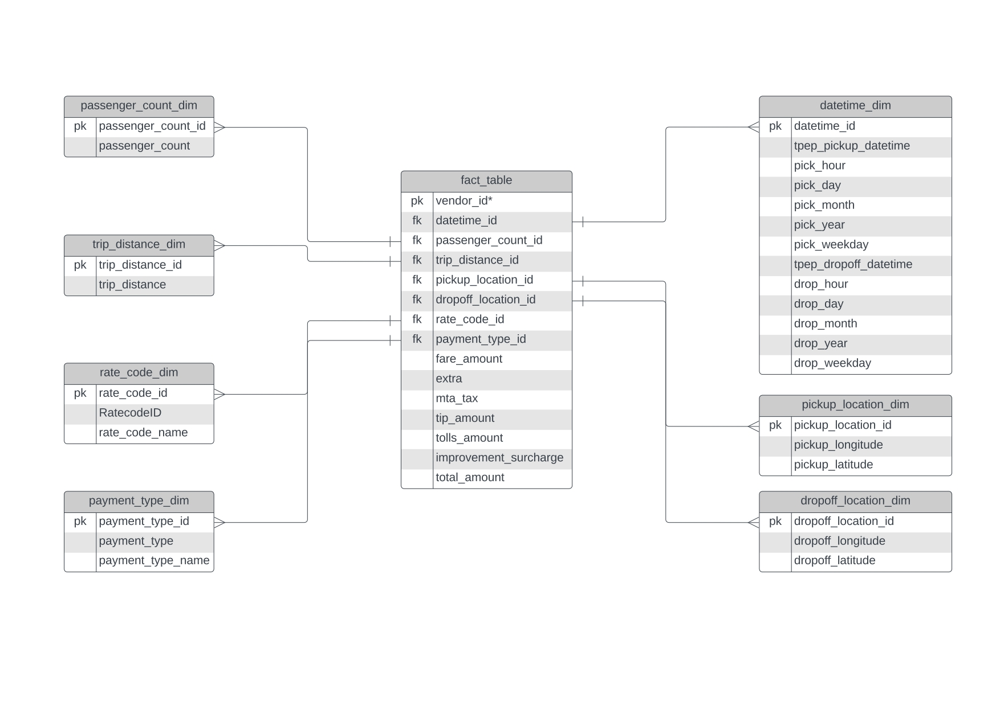

# NYC Taxi Data Analysis Project

## Overview

This project focuses on analyzing a sample of NYC taxi ride data to uncover insights, trends, and patterns. We aim to clean and preprocess the data, engineer meaningful features, and conduct exploratory data analysis (EDA) to answer key questions about taxi usage in New York City.

### Objectives

- Identify peak hours for taxi rides.
- Understand fare dynamics based on distance and duration.
- Analyze tipping behavior.
- Explore patterns across different days of the week.

## Architecture

The architecture of the project is visualized below, showing how raw data from Google Cloud Storage is processed using Mage, and the resulting analytics are stored in BigQuery and visualized using Looker.

## Data Model

The following data model diagram illustrates how the data is structured within the project, with fact tables and dimension tables supporting the analysis:

## Data Processing

1. **Data Loading and Initial Exploration**

   - Load the dataset.
   - Perform an initial inspection of the data.

2. **Data Cleaning and Preprocessing**

   - Handle missing values, duplicates, and incorrect data types.
   - Convert datetime fields.
   - Create unique identifiers for each trip.

3. **Feature Engineering**

   - Extract additional features from datetime columns.
   - Create dimension tables for further analysis.

4. **Exploratory Data Analysis (EDA)**
   - Analyze the distribution of various features.
   - Identify trends and patterns.

## Conclusion

The project successfully uncovers key insights about NYC taxi rides, such as peak hours, fare dynamics, tipping behavior, and weekly patterns. These insights can inform decisions related to urban transportation planning, pricing strategies, and customer behavior analysis.
